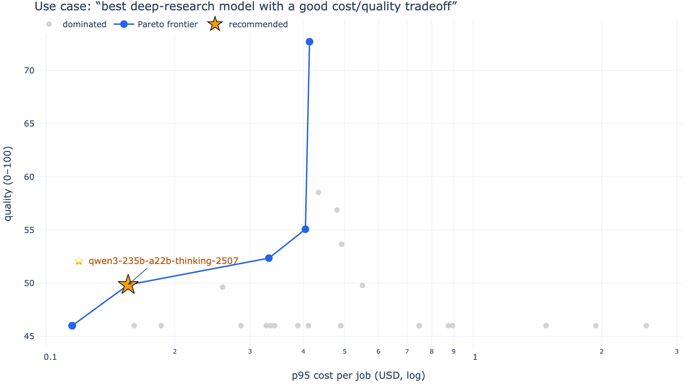
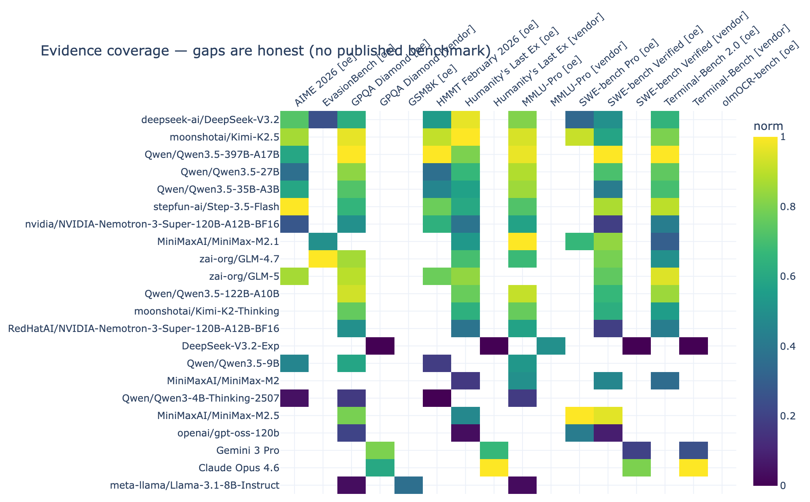
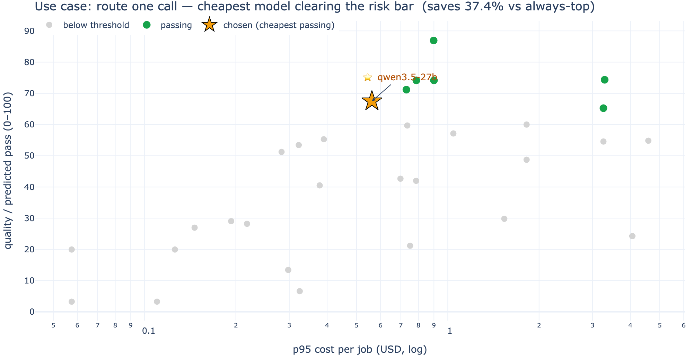

# llm-pareto — LLM Meta-Leaderboard

Pick the best LLM for **a specific task**, trading off quality, cost, and context — and re-run it
whenever new models ship.

Instead of one universal ranking, `llm-pareto` pulls numbers from published benchmarks and live pricing,
normalizes them honestly, and returns a **cost-quality Pareto frontier** filtered by your constraints.
The same data gives different winners for "deep research under $3" vs. "cheapest coding agent."

## Contents

- [How it works](#how-it-works)
- [Five ideas that make the numbers trustworthy](#five-ideas-that-make-the-numbers-trustworthy)
- [Install](#install)
- [Quick start](#quick-start)
- [See it in action](#see-it-in-action)
- [Visualization (dashboard)](#visualization-dashboard)
- [Commands](#commands)
- [Data sources](#data-sources)
- [Offline & reproducible](#offline--reproducible)
- [Profiles](#profiles)
- [API](#api)
- [Tests](#tests)
- [Project layout](#project-layout)
- [Limitations](#limitations)

## How it works

```
ingest published evidence  →  normalize within each benchmark  →  join to live pricing
   →  score per task profile  →  filter by constraints  →  Pareto frontier  →  (optional) route one call
```

Everything lands in a **single local SQLite warehouse** (`outputs/leaderboard.db`). Once built, every
query (CLI, SQL, API, dashboard) runs **fully offline** — only `ingest` touches the network.

## Five ideas that make the numbers trustworthy

- **Within-benchmark only.** Scores are compared inside one benchmark, never averaged across unlike ones.
  A preference rating, a pass rate, and a dollar price are never blended on a raw scale.
- **Coverage, not false confidence.** Missing evidence is imputed to a neutral prior but tracked as
  `coverage` and penalized — a thinly-measured model never looks as certain as a fully-measured one.
- **Access axis.** Every model is tagged `api` (served only behind a vendor API — Claude, GPT, Gemini)
  or `open_weight` (downloadable, self-hostable). You can filter on it.
- **Evidence flag.** Each candidate is `measured` (real benchmark), `transferred` (matched via a
  related name/family, shrunk toward the prior), or `price_only` (priced but no benchmark yet) — shown,
  not hidden.
- **Full lineage.** Every number keeps its source, retrieval date, raw + normalized score, and a
  snapshot checksum.

## Install

```bash
python3 -m venv .venv && . .venv/bin/activate
pip install -e '.[dev,analytics,server,viz]'    # viz = the dashboard
```

Python ≥ 3.11. The CLI installs as `llm-pareto` (also `python -m llm_pareto.cli`).

## Quick start

Build the whole warehouse from empty, then ask it questions:

```bash
make warehouse                # one-shot: build the local DB from all sources
llm-pareto ask --query "best model for deep research with a good quality/cost tradeoff"
```

`make warehouse` reads API keys from a local `.env` (see [Data sources](#data-sources)). Without keys it
still builds — gated sources just record a "blocked" status instead of inventing data.

## See it in action

Three questions, three different answers from the **same** warehouse — the core idea is that "best"
depends on the task, the budget, and what evidence actually exists.

### 1. "Best deep-research model with a good cost/quality tradeoff?"

```bash
llm-pareto ask --query "best model for deep research with a good quality/cost tradeoff"
```



Every priced model is a point. The **blue frontier** is the non-dominated set; grey points are dominated
(something is better *and* cheaper). The **⭐** is the recommended pick — here the knee point, where
quality stops being worth the extra cost. Move the budget slider and the star moves.

### 2. "Where does the evidence actually exist?"

The coverage map shows each model's normalized score per benchmark. **Gaps are real** — no published
number — and benchmarks are tagged `[oe]` (independent harness) vs `[vendor]` (self-reported), so you can
see at a glance that frontier API models (bottom rows) are thinly covered until you add more sources.



This is why recommendations carry a `coverage` score and an `evidence` flag (`measured` / `transferred` /
`price_only`) instead of pretending every model is equally well-measured.

### 3. "Route one call — cheapest model that clears a risk bar."

```bash
llm-pareto route --profile profiles/coding_agent_balanced.toml --risk medium
```



**Green** models clear the risk-tier quality threshold; grey ones don't. The **⭐** is the
cheapest passing one — often a fraction of the cost of always reaching for the top model.

## Visualization (dashboard)

The charts above are static renders of the live dashboard — start it to explore interactively:

```bash
llm-pareto dashboard          # opens http://localhost:8501
```

That launches an interactive Streamlit app over the same warehouse. Type a question in plain English;
the sidebar sliders (budget, weights, **access type**, **show price-only**, risk tier) re-run the engine
live. Five tabs:

| Tab | What it shows |
|---|---|
| 🔎 **Ask & Pareto** | NL question → cost-quality scatter (frontier highlighted, ⭐ = pick, dominated greyed) + written rationale + the auditable interpreted profile. |
| 🚦 **Router** | Cheapest model that clears a risk-tier quality bar, with savings vs. always-picking-top. |
| 🗺️ **Coverage** | Models × benchmarks heatmap — where evidence exists and where it's missing. |
| 🔬 **Lineage** | Pick a model → every observation with source, date, raw+normalized score, checksum, and verifying snippet. |
| 🛣️ **Routes** | Per-provider serving economics (price / quant / uptime / throughput) for one model. |

Point it at a specific DB with `llm-pareto dashboard --db <path>` (or `LLM_PARETO_DB=<path>`).

## Commands

All commands take `--db` (default `outputs/leaderboard.db`) and print JSON to stdout.

| Command | What it does |
|---|---|
| `llm-pareto ask --query "<text>"` | Plain-English question → compiled profile → answer. Add `--json`. |
| `llm-pareto recommend --profile <toml>` | Run a profile → Pareto frontier + recommended default. |
| `llm-pareto route --profile <toml> --risk <tier>` | Cheapest model clearing a risk-tier quality bar. |
| `llm-pareto ingest --source <name>` | Fetch + parse one source into the warehouse. |
| `llm-pareto normalize` | Compute benchmark-local normalized scores. |
| `llm-pareto export catalogs` | Dump catalog CSVs to `outputs/catalogs`. |
| `llm-pareto analytics parquet` | Export Parquet (DuckDB/pandas-ready); `postgres-ddl` generates DDL. |
| `llm-pareto check` | Integrity checks (FK, normalized ∈ [0,1], cohort sizes). |
| `llm-pareto dashboard` | Launch the Streamlit UI. |
| `llm-pareto init` / `registry import` | Create the schema / load the source census. |

`--as-of YYYY-MM-DD` pins a date; otherwise queries use the latest snapshot in the warehouse.

## Data sources

Quality and price come from several sources, each kept in its own cohort and provenance-stamped:

| Source | `--source` | Gives | Access |
|---|---|---|---|
| OpenEvals (HF) | `openevals` | Open-weight capability benchmarks (the backbone) | open |
| OpenRouter | `openrouter` | Pricing + context for 300+ deployments | open |
| Aider Polyglot | `aider_polyglot` | Coding-agent pass@2 (with cost) | open |
| Artificial Analysis | `artificial_analysis` | Intelligence Index + GPQA/HLE/SWE/Terminal-Bench + price, incl. **API models** | key-gated |
| llm-stats.com | `llm_stats` | Third-party aggregated per-benchmark scores | key-gated |
| Vendor claims | `vendor_claims` | Self-reported numbers — **verified to appear on the cited page** before ingest | curated |
| LM Arena / HF official | `lmarena` / `hf_official` | Human preference / gated leaderboards | fail-soft / token-gated |

**API-access models** (Claude, GPT, Gemini) barely appear in open-weight leaderboards, so their numbers
come from Artificial Analysis, llm-stats, and verified vendor claims. Gated sources never fabricate —
they record a blocked status when a key is absent.

**Keys** go in a gitignored `.env` (template: `.env.example`); `make warehouse` / `make refresh-live`
auto-load it. Keys are sent on requests only and never written to stored snapshots.

```bash
cp .env.example .env        # then fill in AA_API_KEY etc.
```

## Offline & reproducible

The warehouse is a self-contained SQLite file — query it any way you like, no network:

```bash
sqlite3 outputs/leaderboard.db "SELECT display_name FROM entities LIMIT 5;"
llm-pareto recommend --profile profiles/coding_agent_balanced.toml   # reads the DB only
```

For a deterministic, network-free build, ingest from the frozen fixtures in `tests/fixtures/`:

```bash
llm-pareto init
for s in openevals openrouter aider_polyglot; do
  llm-pareto ingest --source $s --as-of 2026-06-18 \
    --fixture sample.$([ $s = aider_polyglot ] && echo txt || echo json)
done
llm-pareto normalize
```

## Profiles

A profile (`profiles/*.toml`) describes one decision: constraints, your token workload, dimension
weights, and how each weighted dimension maps to task families. This is what makes a recommendation
task-specific — edit one and re-run `recommend`.

```toml
[constraints]
max_cost_usd = 3.0
min_context_tokens = 200000
min_evidence_coverage = 0.30   # drop candidates that are mostly imputed prior

[weights]
general_intelligence = 0.35
quant_finance_agent  = 0.40
human_preference     = 0.15
context_headroom     = 0.10
```

See `profiles/finance_deep_research_under_3.toml` for a fully annotated example.

## API

```bash
uvicorn llm_pareto.server:app --reload
# GET  /sources /entities /benchmarks /observations /prices /lineage/{id} /profiles
# POST /recommend {"profile": "finance_deep_research_under_3"}
# POST /route     {"profile": "coding_agent_balanced", "risk_tier": "low"}
```

## Tests

```bash
pytest -q          # math, adapters, router, API, access/evidence
llm-pareto check   # warehouse integrity
```

## Project layout

```
src/llm_pareto/
  cli.py            command entry points
  pipeline.py       ingest / normalize / integrity orchestration
  adapters/         one module per source (fetch + parse → canonical records)
  normalization.py  tie-aware empirical-CDF (within-cohort only)
  scoring.py        weighted quality + coverage / missing-evidence penalty
  recommend.py      profile → candidates (access + evidence) → Pareto frontier
  identity.py       access classification + join-key bridging
  router.py         pre-call cheapest-passing router
  server.py         FastAPI app          dashboard.py   Streamlit UI
profiles/           task decision profiles (TOML)
docs/               methodology + source terms
```

## Limitations

Public benchmarks **shortlist, they don't certify** — run a private acceptance test before production.
Agent benchmarks confound model + scaffold; preference pools have judge effects; context capacity ≠
effective long-context; self-reported/aggregator numbers use mixed protocols and stay in their own
cohort. See `docs/methodology.md` for the full list.
